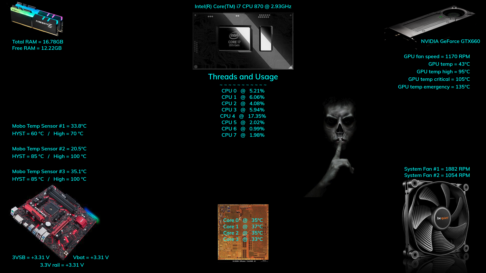

## MMM-HardwareMonitor

* A single, full page module that monitors several system components

## Tried something new and different

* I wanted a hardware monitor that occupied an entire page for use with Hello Lucy.

## Disclaimer

This module will NOT work out of the box for you. Why? Because everyone's hardware is different.
So, you'll have to modify things for it to work for your specific hardware.
Unless, you can figure out a way to make it work for all incarnations of hardware.
That is way beyond my capabilities.

## Examples

* One with color. One standard white.

## Installation

* `git clone https://github.com/mykle1/MMM-HardwareMonitor` into the `~/MagicMirror/modules` directory.

* `npm install` in your `~/MagicMirror/modules/MMM-HardwareMonitor` directory.

## Config.js entry and options

    {
           disabled: false,
           module: 'MMM-HardwareMonitor',
           position: 'fullscreen_above',
		   config: {
		        videoCard: "NVIDIA GeForce GTX660", // name of your video card
        	   	maxWidth: "100%",
        	   	animationSpeed: 0,         // 0 = no fade in and out. Only CPU load and Free RAM usage changes.
			    updateInterval: 15 * 1000, // How often the CPU and Free RAM is checked for load and usage.
		}
    },
	
## Huge thanks to "Sam" for gaining access to data that I could not.